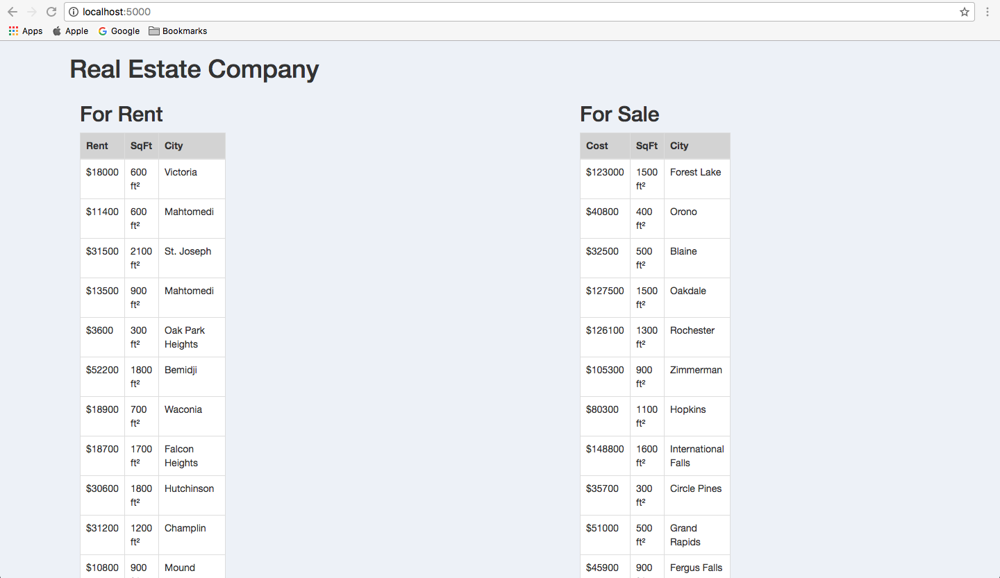

# Prime Digital Academy Weekend Challenge 4 - Mongo and Bootstrap
Weekend assignment, displaying real estate listings, and accounting for inconsistent data types in Mongo.

## Product Example

## Getting Started

These instructions will get you a copy of the project up and running on your local machine for development and testing purposes.
1. Download .zip of the project
2. Run this command in Terminal: mongoimport --db realestate --collection listings --file listingData.js
3. npm install
4. mongod
5. npm start
6. localhost:5000 in a browser

## Technologies Used
- JavaScript
- jQuery
- Node
- MongoDB
- Bootstrap

## Instructions I was given

Welcome to weekend challenge 4! This weekend, you will take on the role of an application developer for a real estate company. You will be working with Data that we will be providing to you. It will be a collection called “listings”. Inside of it, you will find information for properties that are either for Rent or for Sale.

You job, is to get this Data on the DOM, accounting for the inconsistent datatypes that are possible with MongoDB. But additionally, let’s bring in Bootstrap to the mix to make sure that the application looks as good as possible.

Here are the requirements of the project:
* Create a Full Stack application from the ground up using jQuery, Node, and MongoDB,
* Work with the data set that we provide for you,
* Use Bootstrap to present the data,
* Account for the different data (“rent” versus “cost) and ensure that this is noted on the display of the information, by listing “For Rent” or “For Sale” based on which of the two properties that it has.

To work with the provided data:
* Download the provided file,
* Run this command in your Terminal: `mongoimport --db realestate --collection listings --file listingData.js`
* Note that you will need to run this from the folder which you download the ‘listingData.js’ to.

## Hard Mode
Create an interface for adding additional properties to the collection. You will need to give the user an option for either a Rent property, or a Sale property. Check out this Stack Overflow for information on how to accomplish this:
http://stackoverflow.com/questions/14453864/use-more-than-one-schema-per-collection-on-mongodb

## Pro Mode
Host the application on Heroku and mLabs. You will need to transfer the data up to mLabs. In will need to research to accomplish this.
